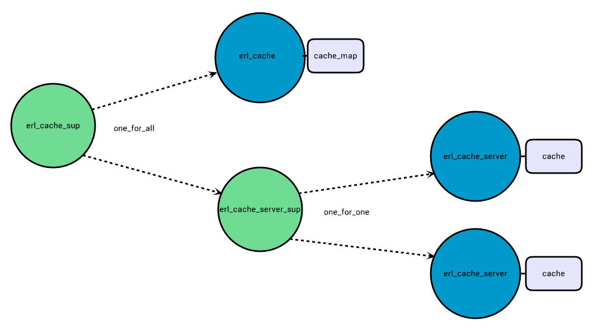

<!---
@doc <!-- -->

<h3>Purpose</h3>

This application is meant to facilitate the process of caching function calls within an erlang node.
Do not expect a complex distributed application here. There are far more complex products out there
intended to act that way. Instead, erl_cache intends to be a simple solution that unifies common
caching patterns within an erlang node which you probably have implemented a thousand times in one
thousand slightly different ways. It's also a nice library if you want to do memoization in Erlang.

<h3>Functional Description</h3>

The erl_cache module acts as the main application interface, allowing you to start/stop independent
cache servers and interact with them.

Each entry in a cache can be either <code>valid</code>, <code>overdue</code> or <code>evict</code>. The difference between overdue and
evict is that, when a overdue entry is requested, and in case a refresh callback was indicated
when first setting it, it will be refreshed and so back into valid state. Evict entries will be
removed from cache when hit and never returned to the client.

From a user point of view, those independent cache servers provide independent namespacing. Each
cache server uses its own set of default options and can crash without affecting any of the others.

From a system point of view, erl_cache acts as a server of caches, holding the cache names and their
associated defaults in a protected ets table. erl_cache is also responsible for option validation in
every call.

erl_cache_server holds the actual cache in its own protected ets table and implements the logic
behind the refreshing overdue entries when hit and the eviction of old entries

<h3>Status of an entry</h3>

Every cached entry can be in one of the following three states:
<ul>
<li> Valid: any request of that key will result in a hit and the stored value will be returned. An
entry is in the valid state as long as indicated by the <code>validity</code> option.</li>
<li> Overdue: the entry <code>validity</code> period has passed but  <code>validity + evict</code>
period hasn't. Any request for a key in such state will be considered a overdue hit and never a miss.
In case a <code>refresh_callback</code> was specified for the entry when set, the value will be
refreshed and set back to valid state. Depending on whether the <code>wait_for_refresh</code>, the
client will be served the old value or the refreshed one.</li>
<li> Evict: the entry is no longer valid and won't be refreshed. An entry in evict state will never
be returned to the user. Eventually, entries in evict state are removed from the cache.</li>
</ul>

<h3>Caching Error Values</h3>

When caching a function call without checking the return value, or when using the <code>?CACHE</code> macro, the
user might transparently be caching an error result instead of a valid one. When dealing with long
validity times, this could lead to errors in your cached call to consistently propagate
to the upper layer for a long time.

Not caching error values at all is also a questionable practice. Think of an overload situation
when your cached call can't handle the load and returns an error. By not caching that error at all,
the already overloaded application is being hit by more traffic and the overload situation is
getting worse.

Since there is no silver bullet, but seeming clear that error values are to be dealt with using special
care, erl_cache provides <code>is_error_callback</code> and <code>error_validity</code>. By default
this application considers the atom <code>error</code> and tuples <code>{error, _}</code> to be
errors. The default validity for such values is a fifth of the default validity for a normal value.

Since refreshing an error will produce a rather unpredictable result, error entries never enter the
overdue state: either they are valid or to be evicted.

Also, when refreshing a valid overdue entry produces an error, that error will not be used to refresh
the entry. Instead, the error will be logged and the automatic refresh will be disabled for that
entry. The cached value will remain in overdue state without being refreshed until it expires
normally.

<h3>Eviction of expired entries</h3>

It's important to know that this application works with a lazy eviction strategy. This means entries
are marked to be evicted but still kept in the cache. Once an entry is marked to be evicted, from
a user perspective it's as if the entry does not exist, since it's impossible to retrieve it or refresh
it without explicitly setting it again.

Once every <code>evict_interval</code>, the cache is scanned for entries to be evicted and those
are erased from the cache. Only at that point the evict stats are updated and the memory used by
such entries is freed.

<h3>Configuration</h3>

This application accepts only one configuration option: <code>cache_servers</code>. This is a list of 2-tuples
indicating the name and the default options for each of the caches the application should bring
up at startup. The format is the same used in <code>erl_cache:start_cache/2</code>. i.e.

<pre>
[{erl_cache, [
    {cache_servers, [{my_cache_server, [{wait_until_done, true}, {validity, 5000}, {evict, 3000}]}]}
]}].
</pre>

The default config options unless otherwise specified are:
<ul>
<li>wait_for_refresh: true</li>
<li>wait_until_done: false</li>
<li>validity: 300000</li>
<li>error_validity: 60000</li>
<li>evict: 60000</li>
<li>evict_interval: ServerLevelEvict + ServerLevelValidity</li>
<li>refresh_callback: undefined</li>
<li>is_error_callback: <pre>fun (error) -> true; ({error, _}) -> true; (_) -> false end</pre></li>
</ul>
Since the <code>evict_interval</code> option can only be applied at cache server start up time, it
should be set carefully. This option controls how often entries to be evicted will be deleted from
the cache. There is only one global evict_interval per cache_server and specific validity and evict
values passed to set operations or to the <code>?CACHE</code> macro will not affect it. The evict_interval option
will be ignored in all function calls except for <code>erl_cache:start_server/2</code>.

<h3>The ?CACHE macro</h3>

For ease of use, this application provides the <code>?CACHE</code> macro. This macro can be placed on top of
any public function. Every time the function is invoked, erl_cache will try to retrieve the associated
return value from cache and, in case it's not there, perform the regular function call and cache the
result. Here you can see an example of how to use the macro to avoid sums being performed everytime
sum/2 is called:

<pre>
?CACHE(my_cache_namespace, [{validity, 10000}, {evict, 2000}}]).
sum(A, B) ->
    A + B.
</pre>

<h3>An Important Note</h3>

This application has been designed for in node caching of small datasets. Keep in mind there are no
memory limits or control of any kind except for the ones provided by the Erlang VM itself.

<h3>Benchmarking</h3>
This application has a ready benchmarking suite. It is based on basho bench. To
run the benchmark:

<pre>
$ make benchmark 
</pre>

In order to render the results (gnuplot is needed):
<pre>
$ ./deps/basho_bench/priv/gp_throughput.sh
</pre>

For full usage guide please consult <a
href="http://docs.basho.com/riak/latest/ops/building/benchmarking/">basho bench
documentation</a>.
